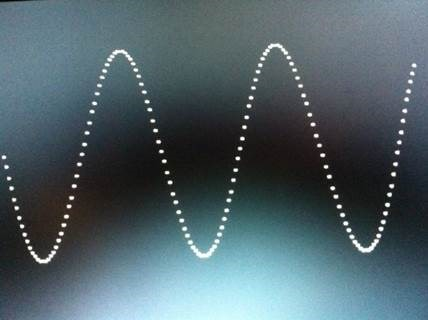
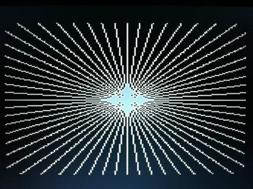
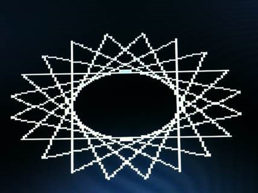
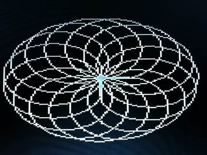
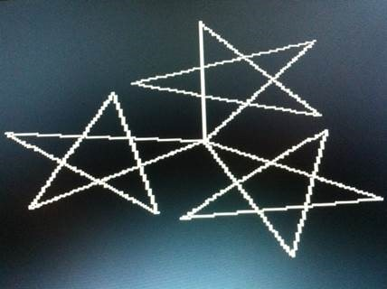
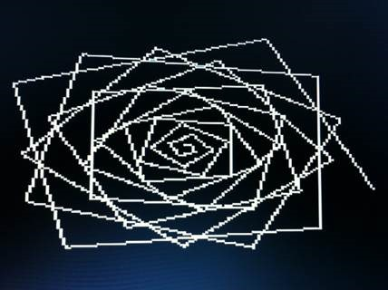
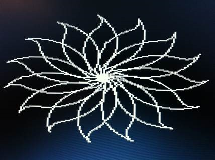

# Turtle Graphics on FIGnition

Some years ago (2012) I had some 8-bit fun playing with the [FIGnition](https://sites.google.com/site/libby8dev/fignition).
This is a wonderful little DIY computer running FIG-Forth as a standalone system complete with flash block editor on an AtMega168 at 20MHz, with 8Kb SRAM, 384Kb flash, and a nifty little 8-button keypad (or [FIGKeys PS/2 interface](https://sites.google.com/site/libby8dev/figkeys)).

I had a blast making a Turtle Graphics implementation for it.

```forth
: sin 160 0 do i i n 4 / 80 + plot loop ;
```



```forth
: burst 60 0 do 0 0 j i h 110 f loop ;
```



```forth
: squiral -50 50 j 20 0 do 100 f 21 t loop ;
```



```forth
: circle 60 0 do 4 f 1 t loop ; 
: spiral 15 0 do circle 4 t loop ;
```



```forth
: star 5 0 do 80 f 24 t loop ; 
: stars 3 0 do star 20 t loop ;
```



```forth
: rose 0 50 0 do 2 + dup f 14 t loop ;
```



```forth
: hp 15 0 do 5 f 1 t loop 15 0 do 2 f -1 t loop ; 
: petal hp 30 t hp 30 t ; 
: flower 15 0 do petal 4 t loop ;
```



## Forth as an “OS”

Most interestingly the FIGnition is a completely standalone FIG-Forth system. It has an 8-button input system and, as is common for old Forths, there is an editor and screen-sized block “file system” of sorts. Compilation happens as blocks are loaded. This is all the “operating system” you need. For the first few days I programmed it entirely this way. This is what is meant when people say that Forth is a language and an operation system. Normally it doesn’t mean giving up a normal keyboard, but still this idea of a complete system entirely in Forth is where it’s at.
 
## Development Host Machine

The above being said, it is quite tedious to program with the 8-button keyboard. Bulk loading of data over USB also works; still a process but easier. The AVRDude tool allows you to transfer source one 500-byte block at a time from a PC/Mac to EPROM. Then you can edit on the device itself and write to flash, from where it can then be loaded/compiled to the dictionary and executed.

## Turtle Graphics!

There was a 160x160 graphics mode added in firmware 0.9.6. This gave me the idea of making a rudimentary Logo-like system (I love it as a teaching language). I had a silly goal of getting it working snugly within a single block of code and managed to pull that off. It adds the following words for controlling the “turtle”:

* `c` – clear screen (cls doesn’t work in 160x160 graphics mode) 
* `g` – Go to an x y coordinate (0,0 is the center of the screen) 
* `h` – Set heading (0-60 - 0 is North, 15 East, 30 South, 45 West) 
* `b` – Begin (enters 160x160 graphics mode, clears, resets turtle) 
* `e` – End (waits for key, exits graphics mode) 
* `t` – Turn the turtle (see h above – negative values for counter-clockwise) 
* `n` – Sine function (used internally – see h above – returns scaled by 255) 
* `m` – Move turtle number of pixels along current heading (no drawing) 
* `p` – Plot pixel currently under turtle
* `f` – Forward number of pixels while plotting
 
This [all fits in a single block](./TurtleCompact.fth) and compiles to just 307 bytes! Or, there is a [less cryptic version here](./Turtle.fth).

### Fixed-point Trig Functions

It uses a table-based cosine function with 6 degree (pi/30 radian) increments – think minute marks on a clock. This is still divisible by many things (2, 3, 4, 5, 6, 10, 12, 15, 20, 30), so it works out well enough for Logo and makes the lookup table small.
 
Resorting to 8.8 fixed-point numbers, I started with a quarter-cosine table with values scaled by 256. This leaves plenty of room for the turtle coordinates with a desired 160*256 range easily with the 16-bit integers supported. Some F# to generate it:

```fsharp
let table =
    let pi = System.Math.PI
    let fix x = round (cos x * 256.) |> int
    Seq.map fix [0. .. (pi / 30.) .. (pi / 2.)]
    Seq.iter (printf "%x ") table
```

Just these values can be reflected and/or shifted to generate sine/cosine results for all sixty angles; something like the following (but in Forth):

```fsharp
let cosine x =
    let a = abs x % 60
    let i = if a > 29 then 60 - a else a
    let s, i' = if i > 14 then -1, 30 - i else 1, i table.[i'] * s

let sine x = x - 15 |> cosine
```

The Forth is intentionally compacted into obfuscation:

```forth
hex create cosTable -2 , F9F2 , E9DD , CEBD ,
AA95 , 7F67 , 4E34 , 1A00 , decimal

: cos ( ang -- cos[ang])
  abs 60 mod dup 29 > if
    60 swap -
  then
  dup 14 > if
    -1 30 rot -
  else
    1 swap
  then
  cosTable + c@ 1+ *
;
```

The rest of the implementation is relatively straight forward ([full source here](./Turtle.fth) or a [compact version here](./TurtleCompact.fth)):

```forth
: heading ( ang --)
  dup angle !
  45 + cos dx !
  dup cos dy !
;

: turn ( turn--)
  angle @ + heading
;

: forward ( dist--)
  >r dx @ x @ y @ dy @
  r 0 do
    >r r + >r over +
    dup 8 >> r 8 >> plot
    r> r>
  loop
  drop y ! x ! drop
  r> drop
;

: jump ( dist--)
  dup dx @ * x +!
  dy @ * y +!
;

: fixPoint!
  >r 80 + 8 << r> !
;

: go ( x y --)
  y fixPoint!
  x fixPoint!
;

: turtleStart
  1 vmode 1 pen cls
  0 0 go 0 heading
;

: turtleEnd
  key 0 vmode
;

: clear
  37760 3200 0 fill
;
```
 
By the way, [here is the original thread in the forum](https://groups.google.com/g/fignition/c/2vBeONSTnWQ/m/UNbyTnv6UQwJ) when this was developed.

Have fun!